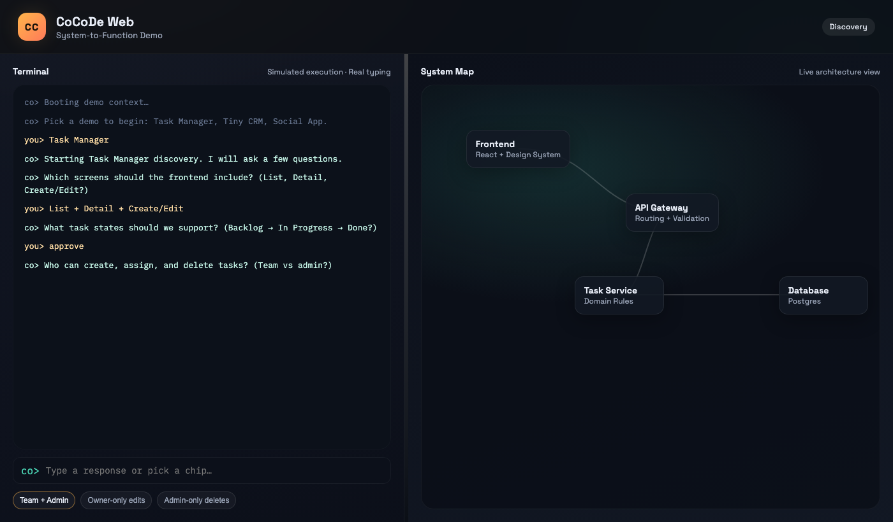

# CoCoDe: Code-focused AI Assistant

CoCoDe is a terminal-based AI coding assistant powered by GPT-4.1. It provides a Claude Code-like experience for developers, with the ability to understand codebases, edit files, interact with Git, and more.

## Features

- **Code Execution**: Run code in various languages directly in the terminal
- **File Editing**: Edit files with precise control and preview changes before applying
- **Git Integration**: Stage, commit, and push changes with AI-generated commit messages
- **Codebase Understanding**: Parse and analyze your codebase for better context
- **Persistent Context**: Save and resume conversations by task or file
- **Beautiful Terminal UI**: Navigate your codebase and interact with the assistant in a polished TUI

## Installation

```bash
# Clone the repository
git clone https://github.com/yourusername/cocode.git
cd cocode

# Install the package
pip install -e .

# Or install dependencies directly
pip install -r cocode/requirements.txt
```

## Usage

```bash
# Configure CoCoDe with your API key
cocode setup

# Run CoCoDe in the current directory
cocode run

# Run with a specific model
cocode run --model gpt-4o
```

## Web Demo (Frontend-Only)

This repo includes a standalone web prototype that demonstrates a split terminal + live system map experience.
It is fully static and runs in the browser (no backend).

**What it does**
- Terminal-style scripted interview for a Task Manager demo
- Live system map that builds as requirements are gathered
- Component deep-dive maps (click any box to drill in)
- Simulated build output with code-like edit snippets

**Run it locally**
```bash
# Option 1: open directly
open web/index.html

# Option 2: serve a local static server
python3 -m http.server --directory web 8000
```

Then open `http://localhost:8000` in your browser.



## Requirements

- Python 3.9 or higher
- OpenAI API key for GPT-4.1
- Git (for Git integration features)

## Architecture

CoCoDe is built on several key components:

- **Model Connector**: Interface with GPT-4.1 API
- **Interpreter Wrapper**: Adapted from Open Interpreter for code execution
- **Git Agent**: Integration with Git for version control
- **File Indexer**: Parse and index the codebase
- **Memory Manager**: Manage conversation history and context
- **TUI Interface**: Terminal UI built with Textual

## Credits

CoCoDe is inspired by Claude Code and leverages the Open Interpreter project for code execution capabilities.
